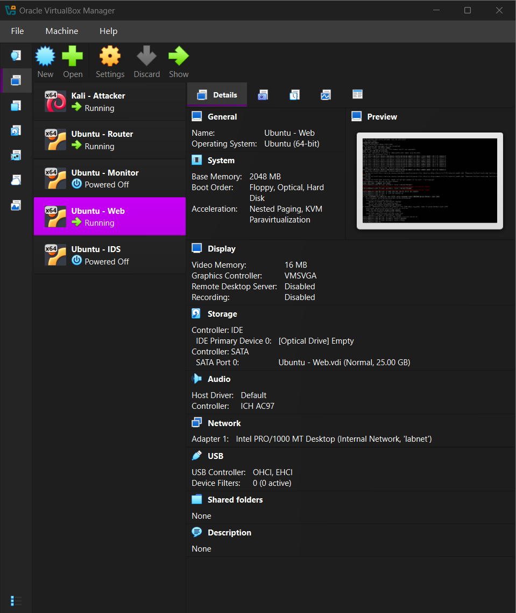
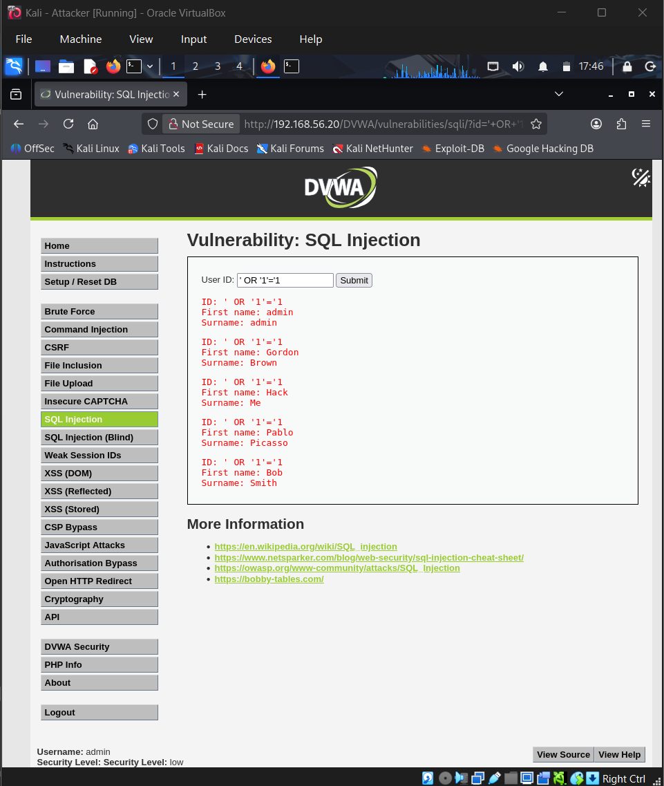
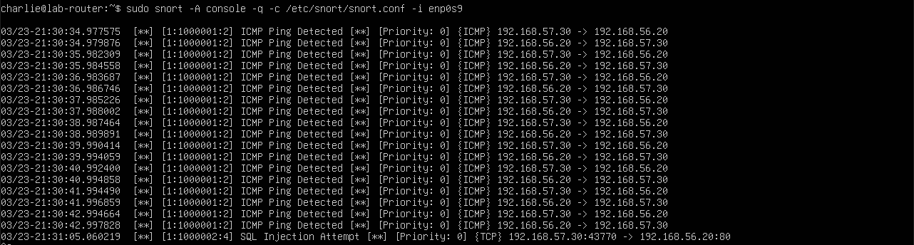

# Snort IDS Lab – Detecting SQL Injection and Reconnaissance

## Overview

This project demonstrates a simulated **Intrusion Detection System (IDS) environment** using **Snort** to monitor network traffic and detect malicious activity targeting a vulnerable web application.

The lab simulates a realistic attack scenario where an attacker performs reconnaissance and exploitation attempts against a web server while Snort inspects the network traffic and generates alerts.

The IDS successfully detects:

- ICMP reconnaissance (ping scans)
- SQL injection attacks against DVWA

---

# Lab Architecture

The environment consists of three virtual machines connected through a monitored network.

- **Kali Linux** – Attacker machine
- **Ubuntu Router** – Runs Snort IDS and inspects traffic
- **Ubuntu Web Server** – Hosts DVWA (Damn Vulnerable Web Application)

Traffic flow:

```
Kali Attacker → Snort Router → DVWA Web Server
```

### Network Topology



### Network Segmentation

The network is segmented so that all traffic between the attacker and the web server passes through the Snort IDS router.

This ensures that Snort can inspect every packet flowing between the attacker and the target server.

Network layout:

Attacker (Kali Linux)  
IP: 192.168.57.30  

⬇  

Router (Snort IDS)  
Interfaces:
192.168.57.1  
192.168.56.10  

⬇  

Web Server (DVWA)  
IP: 192.168.56.20
---

# Technologies Used

- Snort IDS
- Kali Linux
- Ubuntu Server
- DVWA (Damn Vulnerable Web Application)
- VirtualBox

---

# Network Configuration

Each system was configured with static IP addresses to ensure consistent routing through the Snort IDS router.

### Kali Attacker

.png)

### Router

.png)

### Web Server

.png)

---

# Custom Snort Detection Rules

Custom Snort rules were created to detect reconnaissance and attack activity targeting the protected network.

These rules are located in:

```
configs/local.rules
```

### ICMP Reconnaissance Detection

Detects ping scans targeting the internal network.

```snort
alert icmp any any -> $HOME_NET any (msg:"ICMP Ping Detected"; sid:1000001; rev:2;)
```

---

### SQL Injection Detection

Detects SQL injection attempts targeting the DVWA web server.

```snort
alert tcp any any -> $HOME_NET 80 (msg:"SQL Injection Attempt"; content:"OR"; sid:1000002; rev:4;)
```

---

# Attack Demonstration

## SQL Injection Attack

The attacker accesses the DVWA SQL injection page and executes a classic injection payload.

```
' OR '1'='1
```

This bypasses authentication logic and retrieves database records.



---

# Snort Detection Results

## ICMP Reconnaissance Detection

When the attacker performs a ping scan, Snort detects the ICMP traffic and generates an alert.



---

## SQL Injection Detection

When the attacker submits the SQL injection payload, Snort analyzes the HTTP request and triggers the SQL injection detection rule.

The IDS logs the attack attempt and identifies the source IP of the attacker.

---

# Learning Outcomes

Through this project I gained practical experience with:

- Deploying and configuring a **Snort Intrusion Detection System**
- Creating **custom Snort detection rules**
- Simulating **real-world network attacks**
- Detecting **reconnaissance activity and web attacks**
- Designing a **segmented lab network architecture**
- Monitoring and analyzing IDS alerts

---

# Repository Structure

```
snort-dvwa-ids-lab
│
├── README.md
│
├── configs
│   └── local.rules
│
├── setup-guide
│   └── lab-setup.md
│
└── screenshots
    ├── dvwa.sqli-attack.png
    ├── lab.architecture.png
    ├── network-config (kali).png
    ├── network-config (router).png
    ├── network-config (web server).png
    └── snort-icmp-detection.png
```

---

# Future Improvements

Planned enhancements to expand the lab include:

- Nmap scan detection rules
- Brute-force login detection
- Snort alert logging and analysis
- Integration with SIEM tools
- Additional web attack detection signatures

---

# Author

This project was built as part of a cybersecurity lab environment to demonstrate practical IDS deployment and attack detection techniques.
